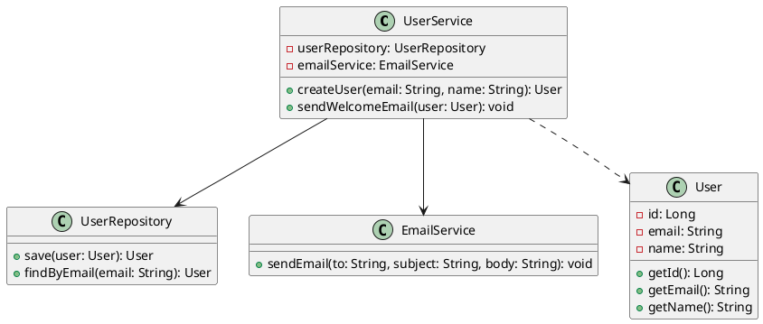
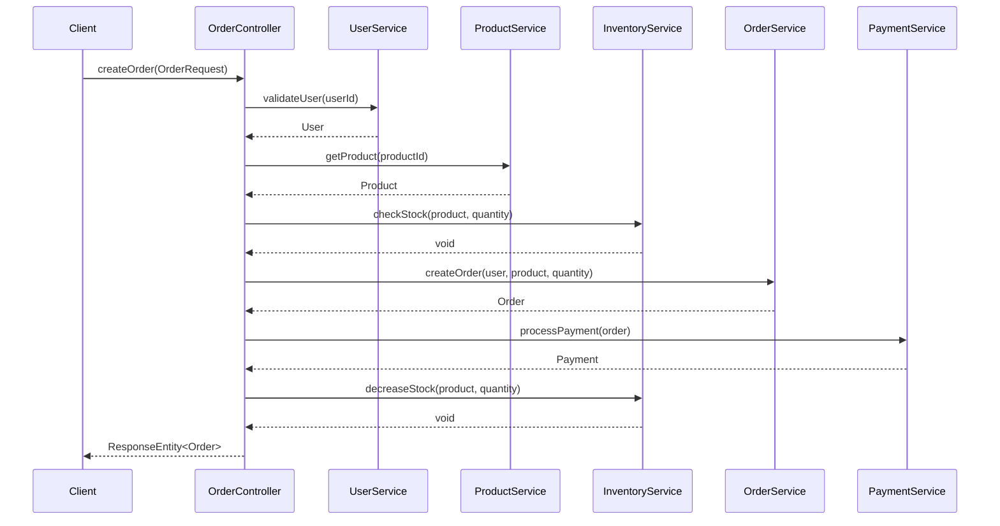

# Cursor를 활용한 코드 리버스 엔지니어링: Class Diagram & Sequence Diagram 생성

## 개요

기존 코드베이스를 이해하고 문서화하는 것은 개발자에게 중요한 작업 중 하나입니다. Cursor AI를 활용하면 복잡한 코드를 효율적으로 분석하여 UML 다이어그램으로 시각화할 수 있습니다. 이 가이드에서는 Class Diagram과 Sequence Diagram을 생성하는 실전 방법을 다룹니다.

## 1. 사전 준비

### 필요한 도구
- **Cursor IDE**: AI 기반 코드 에디터
- **PlantUML 확장**: 다이어그램 생성을 위한 VSCode 확장
- **Mermaid 확장**: 브라우저 기반 다이어그램 도구
- **분석할 코드베이스**: Java, TypeScript, Python 등

### Cursor 설정
```bash
# PlantUML 확장 설치
code --install-extension plantuml.plantuml

# Mermaid 확장 설치  
code --install-extension bierner.markdown-mermaid
```

## 2. Class Diagram 생성 방법

### 2.1 단일 클래스 분석

**프롬프트 예시:**
```
다음 클래스의 구조를 분석하여 PlantUML Class Diagram을 생성해줘:

[코드 붙여넣기]

- 모든 필드와 메서드 포함
- 접근 제어자 표시
- 관계성 명시
```

**실제 적용 예시:**
```java
public class UserService {
    private UserRepository userRepository;
    private EmailService emailService;
    
    public User createUser(String email, String name) {
        // 구현 코드
    }
    
    public void sendWelcomeEmail(User user) {
        // 구현 코드
    }
}
```

**Cursor 생성 결과:**


### 2.2 전체 프로젝트 구조 분석

**단계별 접근법:**

1. **패키지 구조 파악**
```
프로젝트의 전체 패키지 구조를 분석하고, 주요 클래스들 간의 의존성을 Class Diagram으로 표현해줘. 

디렉토리 구조:
src/
├── controller/
├── service/
├── repository/
└── model/
```

2. **계층별 분석**
```
MVC 패턴으로 구성된 다음 코드들의 관계를 Class Diagram으로 표현해줘:

Controller Layer: [컨트롤러 코드들]
Service Layer: [서비스 코드들]  
Repository Layer: [레포지토리 코드들]
Model Layer: [모델 코드들]
```

### 2.3 고급 분석 기법

**상속 관계 분석:**
```
다음 코드에서 상속, 구현, 의존성 관계를 모두 포함한 상세한 Class Diagram을 생성해줘:

[상속 구조가 있는 코드]

요구사항:
- 추상 클래스와 인터페이스 구분
- 상속 관계 화살표 표시
- 의존성 주입 관계 표현
```

## 3. Sequence Diagram 생성 방법

### 3.1 메서드 호출 흐름 분석

**기본 프롬프트:**
```
다음 메서드의 실행 흐름을 Sequence Diagram으로 표현해줘:

[메서드 코드]

- 모든 메서드 호출 순서 표시
- 조건문과 반복문 처리
- 예외 처리 흐름 포함
```

**실제 예시:**
```java
public class OrderController {
    public ResponseEntity<Order> createOrder(OrderRequest request) {
        // 1. 사용자 검증
        User user = userService.validateUser(request.getUserId());
        
        // 2. 재고 확인
        Product product = productService.getProduct(request.getProductId());
        inventoryService.checkStock(product, request.getQuantity());
        
        // 3. 주문 생성
        Order order = orderService.createOrder(user, product, request.getQuantity());
        
        // 4. 결제 처리
        Payment payment = paymentService.processPayment(order);
        
        // 5. 재고 차감
        inventoryService.decreaseStock(product, request.getQuantity());
        
        return ResponseEntity.ok(order);
    }
}
```

**생성된 Sequence Diagram:**


### 3.2 복잡한 비즈니스 로직 분석

**조건분기가 있는 경우:**
```
다음 코드의 모든 실행 경로를 포함한 Sequence Diagram을 생성해줘:

[조건문이 포함된 복잡한 로직]

- if/else 분기 표현
- 예외 상황 처리
- 비동기 호출 표시
```

**반복문 처리:**
```
다음 배치 처리 로직의 Sequence Diagram을 생성해줘:

[반복문이 포함된 코드]

- loop 구문 사용
- 배치 크기 표시
- 에러 처리 로직 포함
```

## 4. 실전 워크플로우

### 4.1 체계적 분석 프로세스

1. **코드 구조 파악**
```
이 프로젝트의 전체 아키텍처를 파악하기 위해 다음을 분석해줘:
- 주요 패키지와 클래스 식별
- 디자인 패턴 적용 현황
- 의존성 관계 매핑
```

2. **핵심 플로우 식별**
```
사용자 등록부터 서비스 이용까지의 전체 플로우를 Sequence Diagram으로 표현해줘:
- API 호출 시작점
- 데이터베이스 상호작용
- 외부 서비스 연동
```

3. **다이어그램 최적화**
```
생성된 다이어그램을 다음 기준으로 개선해줘:
- 가독성 향상
- 중요하지 않은 세부사항 제거
- 색상과 스타일 적용
```

### 4.2 자동화 스크립트

**Cursor 자동 분석을 위한 설정:**
```json
{
  "cursor.ai": {
    "codeAnalysis": {
      "autoGenerateDiagrams": true,
      "diagramFormat": "plantuml",
      "includePrivateMembers": false,
      "maxDepth": 3
    }
  }
}
```

## 5. 고급 활용 팁

### 5.1 대규모 프로젝트 분석

**모듈별 분석:**
```
마이크로서비스 아키텍처의 다음 서비스들 간의 상호작용을 Sequence Diagram으로 표현해줘:

Services:
- User Service
- Order Service  
- Payment Service
- Notification Service

API Gateway를 통한 통신 포함
```

**도메인 주도 설계 적용:**
```
DDD 패턴으로 구성된 코드의 도메인 모델을 Class Diagram으로 표현해줘:
- Aggregate 경계 표시
- Entity와 Value Object 구분
- Domain Service 표현
```

### 5.2 다이어그램 품질 향상

**상세 분석 요청:**
```
다음 요구사항을 만족하는 고품질 Class Diagram을 생성해줘:

1. 스테레오타입 사용 (<<interface>>, <<abstract>>)
2. 다중성 표시 (1..*、0..1)
3. 제약조건 명시 ({ordered}, {unique})
4. 패키지 구조 반영
```

**성능 고려사항:**
```
대규모 시스템의 Sequence Diagram을 생성할 때:
- 주요 플로우만 표시
- 비동기 처리 명시
- 타임아웃과 재시도 로직 포함
- 성능 병목 지점 표시
```

## 6. 통합 워크플로우 예시

### 완전한 리버스 엔지니어링 프로세스

1. **초기 분석**
```
다음 Spring Boot 프로젝트를 분석해서:
1. 전체 Class Diagram 생성
2. 주요 API 엔드포인트의 Sequence Diagram 생성
3. 데이터베이스 스키마와의 매핑 관계 표시

[프로젝트 코드 전체]
```

2. **상세 분석**
```
위에서 생성한 다이어그램을 바탕으로:
1. 각 레이어별 책임 분석
2. SOLID 원칙 준수 여부 확인  
3. 개선 사항 제안
```

3. **문서화**
```
분석 결과를 기술 문서로 정리해줘:
- 아키텍처 개요
- 주요 컴포넌트 설명
- 데이터 플로우 설명
- 확장성 고려사항
```

## 7. 도구별 출력 형식

### PlantUML
- 정확한 UML 표준 준수
- 복잡한 관계 표현 가능
- 텍스트 기반 버전 관리 친화적

### Mermaid  
- 웹 친화적 렌더링
- GitHub 통합 지원
- 단순하고 직관적

### 선택 기준
- **PlantUML**: 상세한 설계 문서용
- **Mermaid**: 웹 문서화 및 협업용

## 결론

Cursor를 활용한 코드 리버스 엔지니어링은 레거시 코드 이해, 시스템 문서화, 아키텍처 분석에 매우 유용합니다. 체계적인 접근과 적절한 프롬프트 활용으로 고품질의 UML 다이어그램을 효율적으로 생성할 수 있습니다.

핵심은 단계적 접근과 구체적인 요구사항 명시입니다. 이를 통해 개발팀의 생산성과 코드 품질을 크게 향상시킬 수 있습니다.