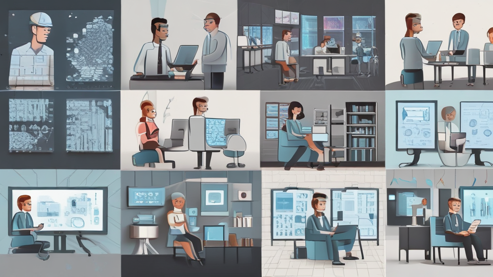

## 금융 코드 전환의 혁명: 삼성SDS Software Engineering Agent가 만드는 미래 엔지니어링

요즘 기술 동향을 살펴보면 인공지능(AI)이 단순한 비서 역할을 넘어, 스스로 판단하고 복잡한 전문 업무까지 처리하는 '에이전트' 단계로 진화하고 있다는 사실에 놀라게 됩니다. 특히, 수십 년간의 역사가 얽혀있는 금융 코드 전환과 같은 난제에 이 AI 기술이 어떻게 적용되고 있는지, 삼성SDS의 'Software Engineering Agent' 사례를 중심으로 상세히 파헤쳐 보겠습니다. 제가 자료들을 꼼꼼히 살펴보니, 이는 단순한 기술 시연을 넘어선 실제적인 생산성 혁신을 설명하고 있습니다.

### 1. 30년 레거시의 벽을 허물다: AI 에이전트의 압도적인 전환 성과

금융권 시스템을 현대화하는 일은 늘 '높은 복잡도', '전환 인력 수급의 어려움', 그리고 '긴 전환 기간 및 비용'이라는 세 가지 큰 장벽에 부딪혀 왔습니다. 수십 년 전에 만들어진 코볼(COBOL)이나 포트란(Fortran) 같은 언어로 짜인 코드를 최신 언어로 바꾸는 작업은, 그 복잡도 자체가 엄청나고, 그 코드를 이해할 수 있는 인력도 구하기 어렵죠. 게다가 전환 과정에서 발생하는 테스트와 규제 준수 문제까지 겹치면 시간과 비용이 천문학적으로 들어갑니다.

그런데 삼성SDS가 파일럿 프로젝트에서 보여준 성과는 이 장벽을 허물고 있습니다. C 코드를 자바로 전환하는 과정에서, Software Engineering Agent가 코드 라인의 98%를 자동 변환했으며, 테스트 통과율도 88.6%에 달했다고 합니다. 제가 체감하기에 가장 놀라운 부분은, 이 과정이 기존 수작업 대비 약 3배의 속도 향상을 가져왔다는 점입니다. 이는 개발팀이 단순 반복 작업에서 벗어나 더 창의적이고 중요한 문제에 집중할 수 있음을 의미합니다. 

### 2. 단순 코딩을 넘어선 '도메인 지식 이해'의 깊이

이러한 놀라운 성과는 에이전트가 단순히 문법을 기계적으로 변환하는 수준을 넘어섰기 때문에 가능했습니다. 제가 분석한 바에 따르면, 이 에이전트들은 코드의 구조(클래스, 함수 관계)를 분석하는 것을 넘어, 해당 시스템이 처리하는 '도메인 지식'과 '업무 맥락'까지 이해하려고 노력합니다.

이들은 코드 베이스를 분석하여 클래스 다이어그램이나 시퀀스 다이어그램 같은 개발 문서를 초기 생성하고, 이 문서를 기반으로 코드를 재생성하고 테스트하는 사이클을 반복했습니다. 심지어 기업 내부의 방대한 지식 베이스나 외부의 최신 개발 프레임워크까지 검색하여 반영하는 '딥 리서치' 기능을 활용한다는 점이 인상적입니다. 제가 직접 이 과정을 상상해 보니, 마치 경험 많은 시니어 개발자가 모든 문서를 꿰뚫고 있는 것과 같더군요. 이처럼 애플리케이션 이해를 기반으로 문서를 정제하고 코드를 재생성하는 방식이야말로 진정한 코드 현대화의 핵심이라고 할 수 있겠습니다.

### 3. AI 에이전트, 금융을 넘어 전 산업으로 확산되다

이러한 AI 기반의 소프트웨어 엔지니어링 혁신은 금융권에만 국한되지 않고, 전 산업으로 빠르게 확산될 조짐을 보이고 있습니다. 예를 들어, KB금융그룹 같은 곳에서는 AI 에이전트를 활용해 금융 상담 기능을 고도화하고, 사내 지식과 연결하여 누구나 쉽게 복잡한 에이전트를 제작할 수 있는 'AI 랩'이나 'AI 스토어'를 구축하고 있다고 합니다. 

또한, 삼성SDS는 자사의 AI 플랫폼인 'FabriX'와 협업 솔루션 'Brity Copilot'을 통해 개인 맞춤형 비서인 '퍼스널 에이전트' 출시를 예고하고 있습니다. 이 에이전트들은 메일 요약, 실시간 통역, 심지어 운전 중 음성 명령 처리까지 담당하며 업무의 연속성을 확보해 준다고 하니, 앞으로 우리의 업무 환경은 상상 이상으로 편리해질 것입니다.

### 4. AI 시대의 새로운 개발자 역할: 협업과 통찰력

이러한 기술 발전 속에서 개발자의 역할은 어떻게 변해야 할까요? 발표에서 언급되었듯이, AI 에이전트가 코드 전환의 98%를 담당하더라도, 최종적인 검수와 미진한 부분의 보정은 여전히 사람 개발자의 몫으로 남습니다.

제가 주목한 레슨은 이렇습니다. AI 에이전트에게 너무 많은 태스크를 한 번에 맡기기보다는, 구간별로 단계를 쪼개 중간중간 테스트하며 검증하는 과정이 필수적이라는 점입니다. 이는 마치 사람이 코딩 중 중간에 print 문을 넣어 상태를 확인하는 것과 같은 원리죠.

결국 AI 에이전트 시대의 핵심은 AI를 단순한 도구로 '이용'하는 것을 넘어, AI와 함께 문제를 정의하고 해결해 나가는 '협업'에 있습니다. 금융 코드 전환이라는 거대한 숙제를 해결하는 이 기술은, 앞으로 모든 분야에서 개발 및 전문 업무의 생산성을 극대화하는 새로운 패러다임을 제시하고 있습니다. 이 혁신적인 엔지니어링의 미래가 우리 업무 환경을 어떻게 바꿀지, 앞으로도 계속 주목해야 할 것 같습니다! 여러분의 생각은 어떠신가요? 